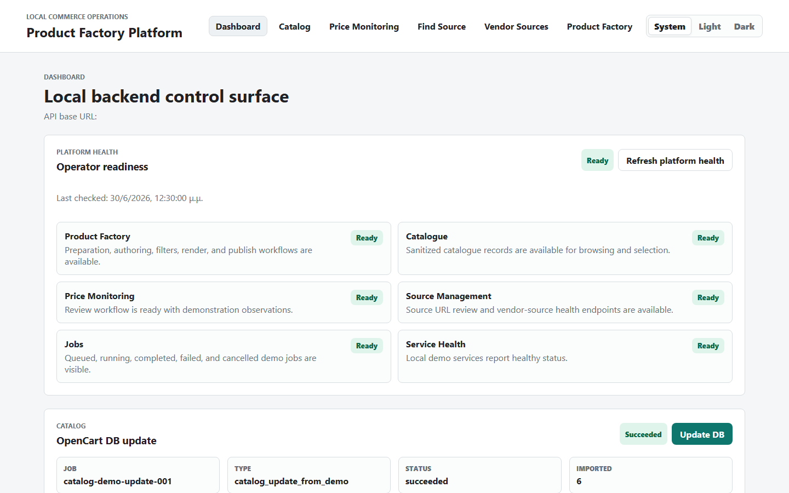
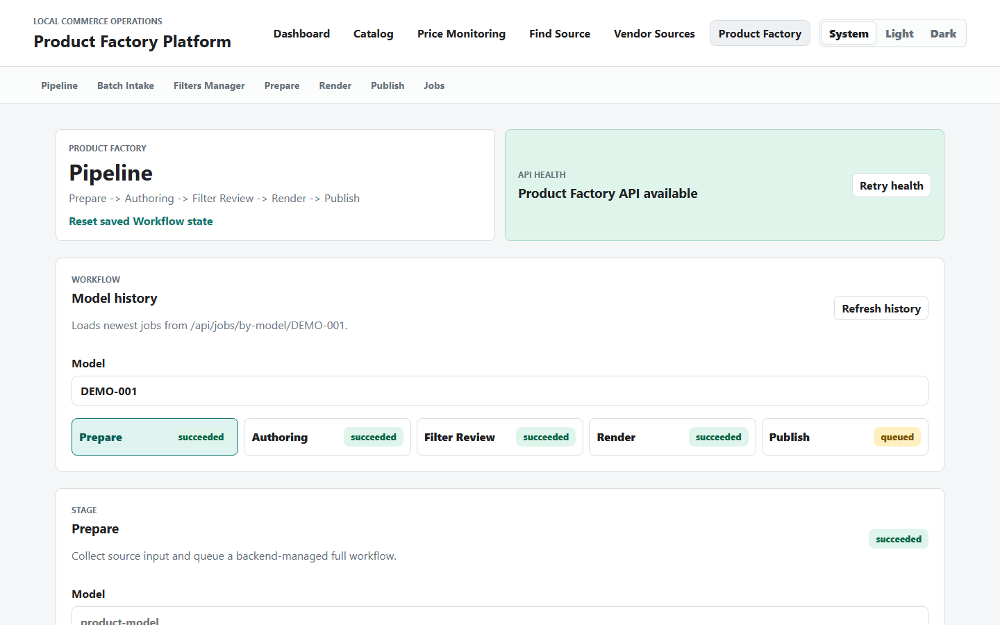
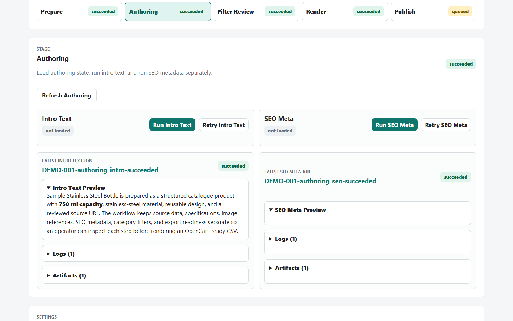
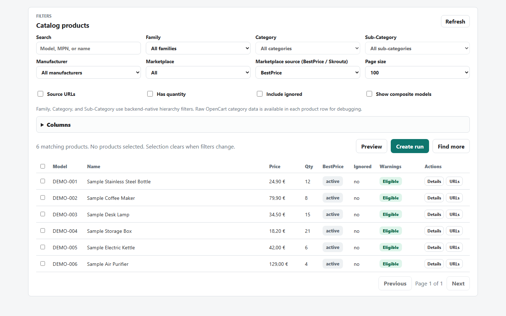
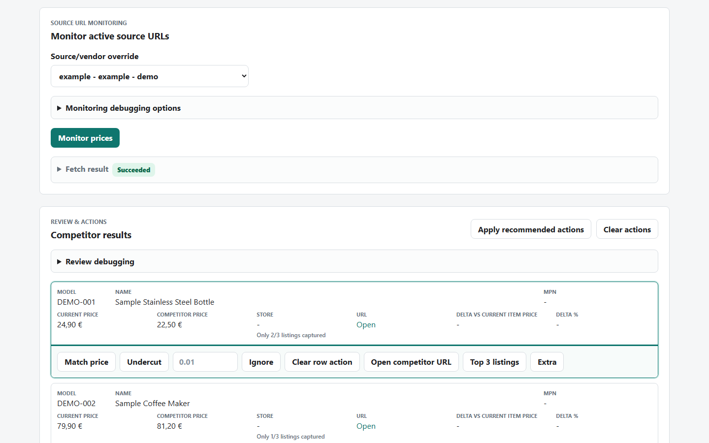
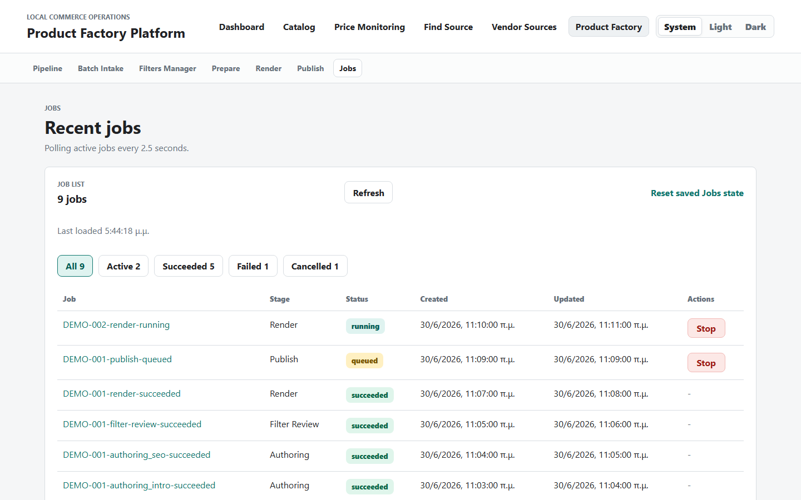
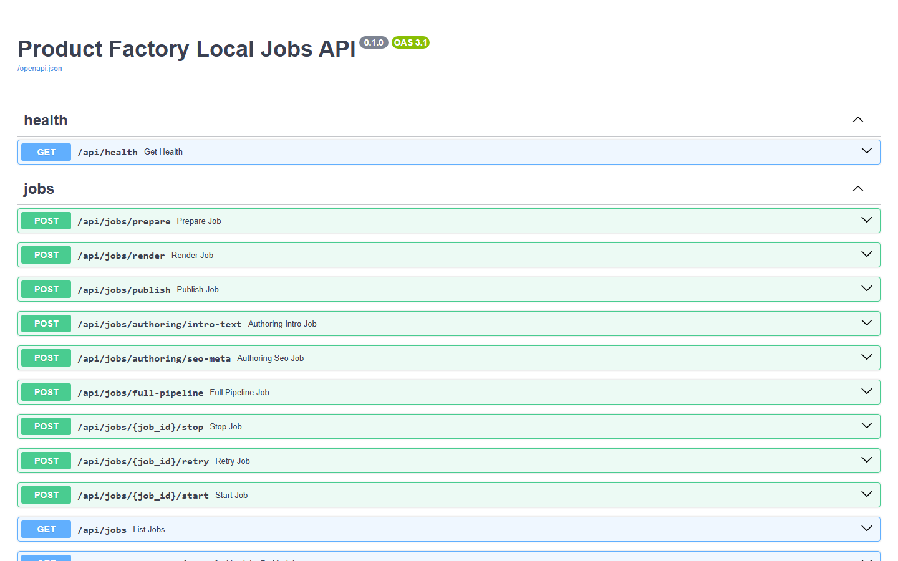
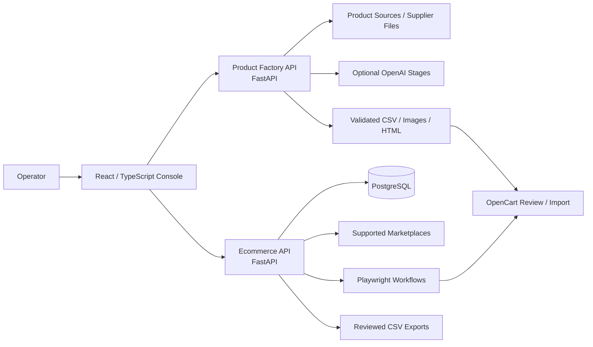

# Price Monitoring & eCommerce Automation Platform

A local, operator-focused project that supports eCommerce product-data preparation, OpenCart catalogue workflows, product-source discovery, competitor-price review, and controlled export-file generation.

The repository contains two Python/FastAPI backend applications, a React/TypeScript operator console, PostgreSQL persistence, browser automation, and optional OpenAI-assisted product-content stages.

> **Project status:** active development. Selected product-data preparation, validation, catalogue, and OpenCart-related workflows are used in a real operating environment. The complete platform is not deployed as a finished public product, and not every module is currently used in production.

## Why I Built It

The project started from real eCommerce operational problems:

- supplier files arrive in inconsistent CSV/XLSX formats
- product attributes, categories, filters, images, and descriptions require repeated manual preparation
- catalogue updates need validation before they reach OpenCart
- competitor prices and source URLs need structured review rather than ad-hoc spreadsheets
- longer browser and data-processing workflows benefit from logs and visible status

The objective is to explore how these manual processes can become more repeatable and reviewable without removing operator control.

## What the Platform Does

### Product Factory

- imports and validates product information from supported pages and supplier data
- normalizes specifications, taxonomy, category filters, images, and metadata
- uses controlled LLM stages for selected copy fields when enabled
- renders product HTML from templates and structured data
- produces OpenCart-ready CSV and image deliverables
- keeps review and validation steps before publishing

### Catalogue and Price Monitoring

- imports an OpenCart catalogue into PostgreSQL
- manages product source URLs and captured source data
- prepares supervised price-monitoring runs
- stores observations, alerts, execution history, and review decisions
- exports reviewed price updates as CSV instead of changing the store directly
- records long-running workflows as jobs with status information and selected retry or recovery handling

### Operator Console

- provides a React/TypeScript interface for both backend applications
- exposes catalogue, source, price-monitoring, Product Factory, review, and job-status workflows
- displays unavailable states when required backend services are not ready

## Screenshots

The screenshots below use sanitized demonstration data. Private credentials, internal URLs, supplier information, production identifiers, and commercially sensitive data are not included.

### Operator Dashboard



*Operator dashboard providing access to Product Factory, catalogue, price-monitoring, source-management, and job-status workflows.*

### Product Preparation Workflow



*Product-data preparation workflow with structured fields, source information, validation, and operator-review steps.*

### Product Output Preview



*Preview of product content, specifications, images, and metadata prepared for review before producing an OpenCart-ready export.*

### Catalogue Browser



*Catalogue view displaying sanitized product, category, brand, source, and status information imported into PostgreSQL.*

### Price-Monitoring Review



*Supervised review of competitor-price observations before producing a controlled CSV update file.*

### Job Status and Execution History



*Execution history and status information for longer-running product, catalogue, source, and monitoring workflows.*

### REST API Documentation



*Interactive FastAPI documentation for selected Product Factory and Ecommerce REST endpoints.*

## Technology Stack

| Area | Technologies |
| --- | --- |
| Backend | Python 3.11+, FastAPI, SQLAlchemy, Alembic, Pydantic |
| Database | PostgreSQL |
| Frontend | React, TypeScript, Vite |
| Automation | Playwright, PowerShell, background job processing |
| AI and discovery | OpenAI API, structured LLM stages, Brave Search integration |
| Data | CSV/XLSX ingestion, validation, normalization, transformation, export |
| APIs and contracts | REST, OpenAPI snapshots, generated TypeScript API types |
| Testing | pytest, Vitest, fixtures, contract checks, and smoke checks |
| Development | Git, GitHub, VS Code, and AI-assisted coding workflows |

## Architecture



The repository is organized into three main applications:

- `product-factory-api` handles product preparation, rendering, validation, and OpenCart-ready artifacts
- `ecommerce-api` handles catalogue, source, monitoring, alert, review, export, job, and PostgreSQL state
- `web` provides the operator interface and communicates with both APIs

## Selected Technical Capabilities

- separate FastAPI applications for Product Factory and Ecommerce workflows
- PostgreSQL schema changes managed through Alembic migrations
- job status tracking, explicit retry paths, and startup recovery handling for selected workflows
- data validation before catalogue or price-update files are produced
- checks for duplicate codes, malformed values, missing data, and potentially unsafe bulk changes
- Playwright-backed OpenCart and marketplace workflows
- API health and database-readiness endpoints
- OpenAPI snapshots and frontend API-type checks
- automated tests using fixtures and mocked external integrations
- execution logs and redacted diagnostics for selected workflows

## My Contribution and AI-Assisted Development

This is an applied learning project based on real eCommerce requirements. I used coding agents and LLM tools extensively to support implementation, refactoring, debugging, documentation, and test creation.

My contribution includes:

- identifying the business problems and describing the required workflows
- providing catalogue, product-data, OpenCart, and operational requirements
- defining expected results, validation rules, and safety conditions
- reviewing generated changes and requesting corrections or improvements
- running the applications and tests and investigating failures
- validating imports, exports, product data, and operator steps against real eCommerce needs
- adapting configuration and selected code paths
- deciding where operator review is required before an action continues

I do not present the repository as a system that I designed and wrote entirely without assistance. It demonstrates how I use programming fundamentals, eCommerce knowledge, testing, and AI-assisted development to build and validate practical technical workflows.

## Production Use and Limitations

Selected scripts and workflow stages are used in a real eCommerce operating environment, particularly for product-data preparation, validation, catalogue handling, and OpenCart-related operations.

Current limitations:

- the platform is designed for local operator use and is not a hosted public SaaS application
- some external and browser-backed workflows require private credentials and cannot be demonstrated from a public clone
- live OpenCart, marketplace, and OpenAI tests are manual or opt-in
- not every module is currently active in production
- the project remains under active development and some workflows are still being consolidated

## Repository Layout

```text
apps/
  product-factory-api/   Product preparation and OpenCart export backend
  ecommerce-api/        Catalogue, source, monitoring, alerts, jobs, and exports
  web/                   React/TypeScript operator console
packages/
  contracts/             Mirrored OpenAPI snapshots and generated contract inputs
scripts/
  setup/                 Local environment setup
  dev/                   Service startup and diagnostics
  test/                  Targeted and aggregate test commands
  contracts/             API contract and generated-type checks
  check/                 Repository hygiene checks
docs/
  architecture/          Current architecture and design constraints
  decisions/             Architecture decision records
  runbooks/              Setup, testing, and operator procedures
```

## Local Quick Start

The current setup targets Windows PowerShell and uses a local PostgreSQL instance.

### Prerequisites

- Python 3.11 or newer
- PostgreSQL with `psql` available on `PATH`
- Node.js and npm
- Windows PowerShell
- Playwright Chromium for browser-backed workflows

Docker is not required for the current local setup.

### Install

From the repository root:

```powershell
.\scripts\setup\root-venv.ps1
.\scripts\setup\python-deps.ps1
.\scripts\setup\web.ps1
.\scripts\setup\check-local.ps1
```

Copy the environment template and add only the private values required for the workflows you intend to run:

```powershell
Copy-Item .env.example .env
```

Do not commit `.env`, credentials, generated product data, raw captures, databases, or runtime output.

### Start the Services

Run each command in a separate PowerShell window:

```powershell
.\scripts\dev\product-factory-api.ps1
.\scripts\dev\ecommerce-api.ps1
.\scripts\dev\web.ps1
```

Local endpoints:

- Web console: `http://127.0.0.1:5173`
- Product Factory API: `http://127.0.0.1:8000/docs`
- Ecommerce API: `http://127.0.0.1:8001/docs`

Ecommerce database migrations must be run from `apps/ecommerce-api` because its Alembic configuration uses app-relative paths:

```powershell
Push-Location apps\ecommerce-api
..\..\.venv\Scripts\python.exe -m alembic upgrade head
Pop-Location
```

For detailed setup, operation, database, testing, and troubleshooting instructions, see [Developer Setup and Operations](docs/runbooks/developer-setup-and-operations.md).

## Tests and Checks

For the standard fast local verification:

```powershell
.\scripts\check\hygiene.ps1
.\scripts\contracts\check.ps1
.\scripts\contracts\check-web-types.ps1
.\scripts\test\fast.ps1
```

Targeted backend checks:

```powershell
.\scripts\test\codex-product-factory.ps1
.\scripts\test\codex-ecommerce.ps1
```

Default fast tests exclude live external services, full browser workflows, slow tests, and PostgreSQL-required integration profiles where appropriate.

## Documentation

- [Developer Setup and Operations](docs/runbooks/developer-setup-and-operations.md)
- [Current Architecture](docs/architecture/current-architecture.md)
- [Operator Startup](docs/runbooks/operator-startup.md)
- [Testing Strategy](docs/runbooks/testing-strategy.md)
- [Ecommerce PostgreSQL Setup](docs/runbooks/ecommerce-postgresql-local.md)
- [Contracts-First Integration](docs/decisions/0005-contracts-first-integration.md)
- [Product Factory API](apps/product-factory-api/README.md)
- [Ecommerce API](apps/ecommerce-api/README.md)
- [Web Console](apps/web/README.md)

## Roadmap

- document the currently production-used workflows more clearly
- add sanitized screenshots or a recorded local demo
- add a small sanitized sample dataset and guided demo
- improve onboarding for non-Windows environments
- increase end-to-end test coverage for selected cross-service workflows
- continue reducing repetitive catalogue and source-review steps while preserving operator approval
